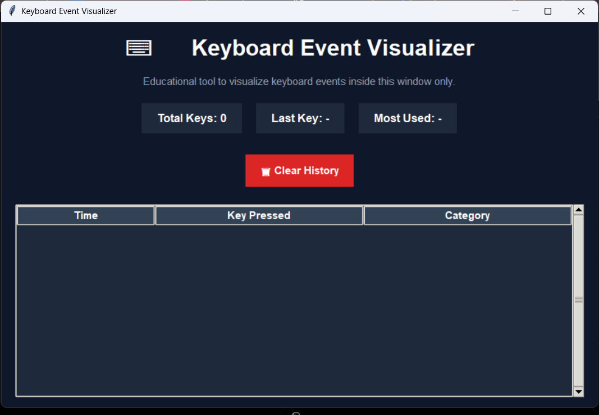
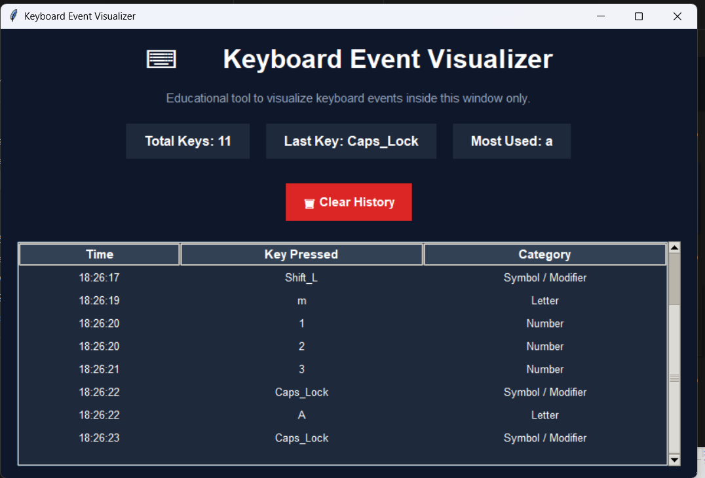
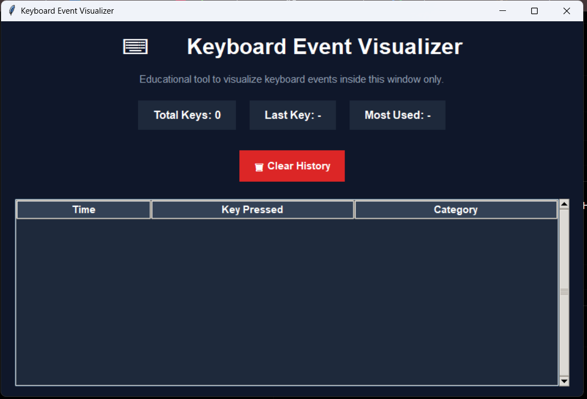

# ⌨️ Keyboard Event Visualizer

An educational Python application that visualizes keyboard events in real-time using Tkinter.

The application captures keyboard input inside the program window and provides statistics, key classification, and activity tracking through a modern graphical interface.

---

## 🚀 Features

- Real-time keyboard event visualization
- Key classification system
  - Letters
  - Numbers
  - Special Keys
  - Symbols / Modifiers
- Timestamp logging
- Total key counter
- Last pressed key display
- Most used key tracker
- Clear history functionality
- Modern dark-themed interface
- Scrollable event table

---

## 🛠️ Technologies Used

- Python
- Tkinter
- ttk
- Datetime
- Collections (Counter)

---

## 📸 Screenshots

### Home Screen



### Keyboard Activity Monitoring



### Clear History Feature



---

## 📂 Project Structure

```text
Keyboard-Event-Visualizer/
│
├── app.py
├── README.md
├── Home.png
├── activty.png
└── Clear.png
```

---

## ▶️ How to Run

Clone the repository:

```bash
git clone https://github.com/YOUR_USERNAME/Keyboard-Event-Visualizer.git
```

Navigate to the project folder:

```bash
cd Keyboard-Event-Visualizer
```

Run the application:

```bash
python app.py
```

---

## 🎯 Learning Outcomes

This project demonstrates:

- Event-driven programming
- GUI development with Tkinter
- Keyboard event handling
- Real-time data visualization
- Python desktop application development

---

## 🔒 Security Notice

This project is designed for educational purposes only.

It captures keyboard events **inside the application window only** and does not monitor system-wide keyboard activity.

---

## 👨‍💻 Author

**Kenaz Halwai**

Computer Science   
Cybersecurity Enthusiast  

---

## 📄 License

MIT License
